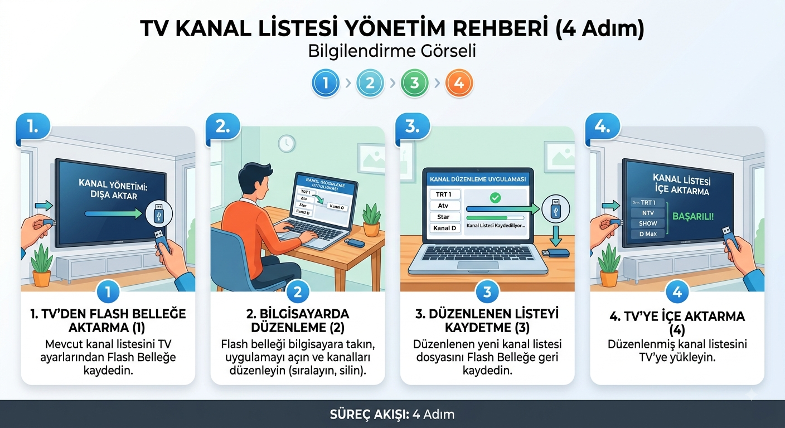

# SCM Kanal Listesi Düzenleyici



Eski Samsung televizyonlardan USB ile alınan uydu kanal listesi (`.scm`) dosyalarını düzenlemek için tamamen tarayıcı içinde çalışan bir araç.

**Canlı adres:** [iltekin.github.io/scm-editor](https://iltekin.github.io/scm-editor)

## Bu araç ne işe yarar?

Samsung TV'nin uydu aramasıyla oluşturduğu `channel_list_....scm` dosyasını açıp:

- Kanalları **yeniden adlandırabilir**,
- Kanal **numaralarını (sırasını)** değiştirebilir,
- Kanalları **toplu silebilir** (tek tek, tür bazlı: SD/HD/Radyo, şifre durumuna göre: şifreli/şifresiz, ya da boş isimli kayıtları),
- **Aratarak sıra oluşturabilir**: arama kutusuna yazıp tıkladığın kanalları istediğin sırayla listenin başına taşıyabilir,
- Radyoları/şifreli kanalları/seçili kanalları listenin **başına veya sonuna** taşıyabilir,

ve sonunda değişiklikleri yeni bir `.scm` dosyası olarak indirip TV'ye geri yükleyebilirsin.

Arayüz **Türkçe ve İngilizce** olarak kullanılabilir (sağ üstteki dil düğmesiyle anında değişir); varsayılan dil Türkçe'dir.

## Nasıl çalışır?

- **Sunucu yok, kurulum yok.** `index.html` dosyasını çift tıklayıp açman ya da yukarıdaki adrese girmen yeterli.
- Yüklediğin `.scm` dosyası **hiçbir zaman internete/sunucuya gönderilmez** — her şey kendi tarayıcının belleğinde işlenir. İstersen tamamen internet bağlantısını keserek de kullanabilirsin.
- `.scm` dosyası aslında bir ZIP arşividir; içindeki `map-SateD` dosyası uydu kanallarının kayıtlı olduğu binary veri bloğudur. Bu araç o veriyi tarayıcının yerleşik `CompressionStream`/`DecompressionStream` API'leri ile açıp düzenler ve tekrar paketler. Diğer tüm dosyalar (transponder veritabanı, uydu veritabanı vb.) değiştirilmeden aynen korunur.

## Kullanım

1. [index.html](index.html) dosyasını bir tarayıcıda aç (çift tıklayarak veya `iltekin.github.io/scm-editor` adresinden).
2. TV'den USB ile aldığın `.scm` dosyasını sürükle-bırak yap veya seç.
3. Kanalları düzenle, sırala, sil.
4. **"Kaydet (.scm indir)"** butonuna bas, indirilen dosyayı USB belleğe kopyala.
5. USB belleği TV'ye takıp "Kanal Listesini Yükle" seçeneğiyle geri yükle.

**Önemli:** Kaydetmeden önce orijinal `.scm` dosyanın bir yedeğini bir kenara koy. Bir sorun çıkarsa orijinaline dönebilmen için.

Elinde henüz kendi `.scm` dosyan yoksa, ilk ekrandaki **"Örnek dosyayı yükle"** bağlantısıyla [example/](example/) klasöründeki gerçek bir kanal listesiyle aracı hemen deneyebilirsin. *(Bu bağlantı yalnızca canlı adres gibi http(s) üzerinden açıldığında çalışır; dosyayı bilgisayarından çift tıklayıp `file://` ile açtığında tarayıcı güvenlik politikası nedeniyle çalışmayabilir — bu durumda kendi `.scm` dosyanı sürükle-bırak ile yükleyebilirsin.)*

## Dosya yapısı

```
index.html          – sayfa iskeleti
style.css            – görünüm
app.js               – tüm mantık (ZIP okuma/yazma, kanal kaydı çözümleme, arayüz, çeviriler)
example/*.scm        – aracı denemek için örnek kanal listesi
```

## Format hakkında not

`.scm` formatı için resmi bir Samsung belgesi yoktur. Bu araçtaki kanal kaydı yapısı (isim, kanal numarası, servis tipi, şifreli/şifresiz bayrağı gibi alanların dosyadaki byte konumları), dosya içeriği doğrudan incelenerek **tersine mühendislikle** çözülmüştür.

**Bu araç yalnızca Samsung UE40ES8000 (2012 model) TV'den alınan bir `.scm` dosyasıyla test edilmiştir.** Başka model veya yıldaki Samsung TV'lerde dosya yapısı farklı olabilir; bu durumda kanal adları yanlış görünebilir veya dosya hiç açılamayabilir. Farklı bir modelde deneyeceksen mutlaka önce orijinal dosyanın yedeğini al.

## Tarayıcı gereksinimleri

Modern bir tarayıcı gerekir (Chrome, Edge, Safari 16.4+, Firefox 113+) — `CompressionStream`/`DecompressionStream` API'lerini destekleyen herhangi bir sürüm. Araç bu API'ler yoksa uyarı gösterir.

---

# SCM Channel List Editor

A tool that runs entirely in your browser for editing satellite channel list (`.scm`) files exported via USB from old Samsung TVs.

**Live URL:** [iltekin.github.io/scm-editor](https://iltekin.github.io/scm-editor)

## What does this tool do?

Opens the `channel_list_....scm` file created by your Samsung TV's satellite scan and lets you:

- **Rename** channels,
- Change channel **numbers (order)**,
- **Bulk-delete** channels (one by one, by type: SD/HD/Radio, by encryption status: encrypted/free-to-air, or empty-named records),
- **Build a custom order by searching**: type in the search box, click the channels you want, and move them to the top of the list in exactly that order,
- Move radios/encrypted channels/selected channels to the **top or bottom** of the list,

and finally download the changes as a new `.scm` file and load it back onto your TV.

The interface is available in **Turkish and English** (switch instantly with the language button in the top right); the default language is Turkish.

## How it works

- **No server, no install.** Just double-click `index.html` to open it, or visit the URL above.
- The `.scm` file you upload is **never sent to a server or the internet** — everything is processed in your own browser's memory. You can even use it fully offline.
- A `.scm` file is actually a ZIP archive; the `map-SateD` entry inside it is the binary data block holding the satellite channels. This tool decompresses that data using the browser's built-in `CompressionStream`/`DecompressionStream` APIs, edits it, and repacks it. All other entries (transponder database, satellite database, etc.) are preserved unchanged.

## Usage

1. Open [index.html](index.html) in a browser (double-click it, or visit `iltekin.github.io/scm-editor`).
2. Drag & drop or select the `.scm` file you got from your TV via USB.
3. Edit, sort, and delete channels as needed.
4. Click **"Save (download .scm)"** and copy the downloaded file to your USB drive.
5. Plug the USB drive into your TV and reload the channel list via "Load Channel List" (or the equivalent option).

**Important:** Keep a backup of your original `.scm` file before saving. That way you can always go back if something goes wrong.

Don't have your own `.scm` file yet? Use the **"Load the example file"** link on the first screen to try the tool immediately with a real channel list from the [example/](example/) folder. *(This link only works when the page is served over http(s), like the live URL — it may not work if you open the file directly via `file://`, due to browser security policy. In that case, drag & drop your own `.scm` file instead.)*

## File structure

```
index.html          – page skeleton
style.css            – styling
app.js               – all logic (ZIP read/write, channel record parsing, UI, translations)
example/*.scm        – sample channel list for trying out the tool
```

## A note on the format

There is no official Samsung documentation for the `.scm` format. The channel record layout used by this tool (byte offsets for fields like name, channel number, service type, and the encrypted/free-to-air flag) was **reverse-engineered** by directly inspecting file contents.

**This tool has only been tested with a `.scm` file exported from a Samsung UE40ES8000 (2012 model) TV.** The file structure may differ on other Samsung TV models or years; in that case channel names may appear incorrect, or the file may fail to open at all. If you try it with a different model, be sure to back up your original file first.

## Browser requirements

A modern browser is required (Chrome, Edge, Safari 16.4+, Firefox 113+) — any version that supports the `CompressionStream`/`DecompressionStream` APIs. The tool shows a warning if these APIs are unavailable.

**Author:** Sezer İltekin ([x.com/sezeriltekin](https://x.com/sezeriltekin))